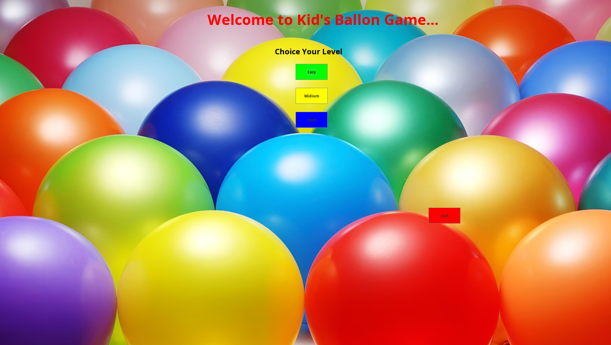
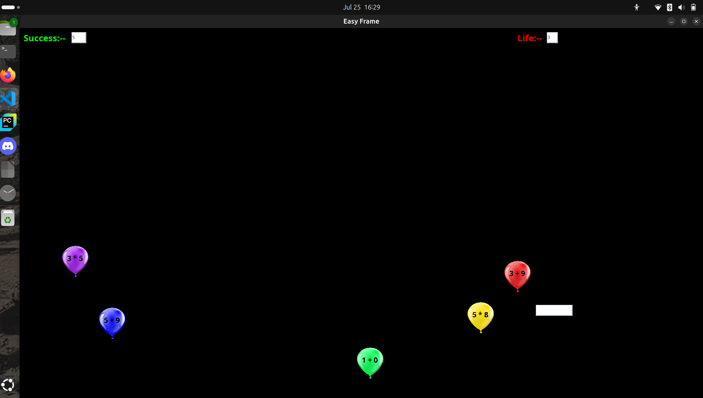
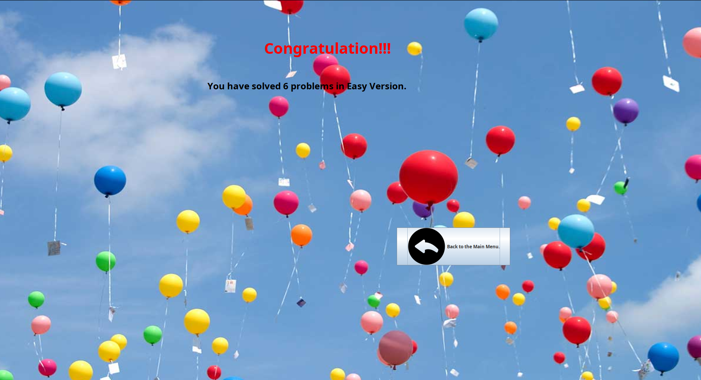

# 🎈 Kid's Balloon Game

A fun and educational Java game where kids can learn basic math operations while popping balloons! This game is built using **Java** and **Swing**, and is suitable for children learning addition, subtraction, multiplication, and division in an interactive way.

---

## 📸 Screenshots

### 🏠 Home Screen


### 🕹️ Gameplay Screen


### 🏆 Success Screen


> _Note: Store your screenshots in a folder named `assets` or adjust the image paths accordingly._

---

## 🚀 How to Run

You can run this project using **VS Code**, **IntelliJ**, or the command line.

### 💻 Using Command Line:
1. Compile:
   ```bash
   javac Main.java
   ```
2. Run:
   ```bash:
   java Main
   ```
###🧠 Game Description

 Gameplay: Multiple balloons float upward, each showing a math equation (e.g., 5 + 3, 4 * 2).

   Goal: Type the correct answer to burst the corresponding balloon.

   Scoring: Every correct answer increases your Success score.

   Lives: You start with 3 lives. If a balloon reaches the top without being popped, you lose a life.

   Game Over: Once all lives are lost, your total number of successful answers is displayed.

### 🎮 Difficulty Levels

From the main menu, choose your level:

   🟩 Easy

   🟨 Medium

   🟦 Hard

Each level increases balloon speed and equation difficulty.

### 🛠️ Built With

   ###### Java

   ###### Java Swing (javax.swing)

   ##### IDEs used: VS Code and IntelliJ IDEA

### 🔒 Authentication

There is no login or signup. Just choose a level and start playing immediately.
### 📚 Educational Benefit

This game is perfect for children to:

   ###### Practice basic arithmetic

   ###### Improve problem-solving speed

   ###### Learn through play

### 👤 Author

Created by a passionate Java developer to make math fun for kids!
📧 [[Add your contact info or GitHub profile link here](https://github.com/Khalidgithub2020331007/Hall_Management_Web)]
### ⚖️ License

This project is released with no license — feel free to use and modify for educational or personal purposes.
### 📁 Folder Structure Suggestion for GitHub

To keep your repository organized:
      ```bash
├── out
│   ├── artifacts
│   │   ├── BackButton.png
│   │   ├── BackgroundBallon2.png
│   │   ├── BackgroundBallon3.png
│   │   ├── BlueBallon.png
│   │   ├── Exit.png
│   │   ├── GreenBallon.png
│   │   ├── Khalid_20203310007.iml
│   │   ├── Khalid_20203310007_jar
│   │   │   ├── BackButton.png
│   │   │   ├── BackgroundBallon2.png
│   │   │   ├── BackgroundBallon3.png
│   │   │   ├── BlueBallon.png
│   │   │   ├── Exit.png
│   │   │   ├── GreenBallon.png
│   │   │   ├── Khalid_20203310007.iml
│   │   │   ├── Khalid_20203310007.jar
│   │   │   ├── MyFrame.png
│   │   │   ├── PurpleBallon.png
│   │   │   ├── RedBallon.png
│   │   │   └── YellowBallon.png
│   │   ├── Khalid_20203310007_jar2
│   │   │   ├── BackButton.png
│   │   │   ├── BackgroundBallon2.png
│   │   │   ├── BackgroundBallon3.png
│   │   │   ├── BlueBallon.png
│   │   │   ├── Exit.png
│   │   │   ├── GreenBallon.png
│   │   │   ├── Khalid_20203310007.iml
│   │   │   ├── Khalid_20203310007.jar
│   │   │   ├── MyFrame.png
│   │   │   ├── PurpleBallon.png
│   │   │   ├── RedBallon.png
│   │   │   └── YellowBallon.png
│   │   ├── MyFrame.png
│   │   ├── PurpleBallon.png
│   │   ├── RedBallon.png
│   │   └── YellowBallon.png
│   └── production
│       └── Khalid_20203310007
│           ├── Congratulation$1.class
│           ├── Congratulation.class
│           ├── EasyFrame$1.class
│           ├── EasyFrame.class
│           ├── Exit$1.class
│           ├── Exit$2.class
│           ├── Exit.class
│           ├── HardFrame$1.class
│           ├── HardFrame.class
│           ├── Main.class
│           ├── META-INF
│           │   └── MANIFEST.MF
│           ├── MidiumFrame$1.class
│           ├── MidiumFrame.class
│           └── MyFrame.class
└── src
    ├── BackButton.png
    ├── BackgroundBallon2.png
    ├── BackgroundBallon3.png
    ├── BlueBallon.png
    ├── Congratulation$1.class
    ├── Congratulation.class
    ├── Congratulation.java
    ├── EasyFrame$1.class
    ├── EasyFrame.class
    ├── EasyFrame.java
    ├── Exit$1.class
    ├── Exit$2.class
    ├── Exit.class
    ├── Exit.java
    ├── Exit.png
    ├── GreenBallon.png
    ├── HardFrame$1.class
    ├── HardFrame.class
    ├── HardFrame.java
    ├── Khalid_20203310007.iml
    ├── Main.class
    ├── Main.java
    ├── META-INF
    │   └── MANIFEST.MF
    ├── MidiumFrame$1.class
    ├── MidiumFrame.class
    ├── MidiumFrame.java
    ├── MyFrame.class
    ├── MyFrame.java
    ├── MyFrame.png
    ├── PurpleBallon.png
    ├── RedBallon.png
    └── YellowBallon.png
```
